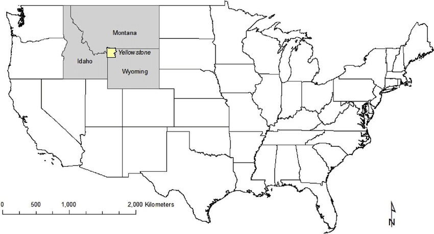
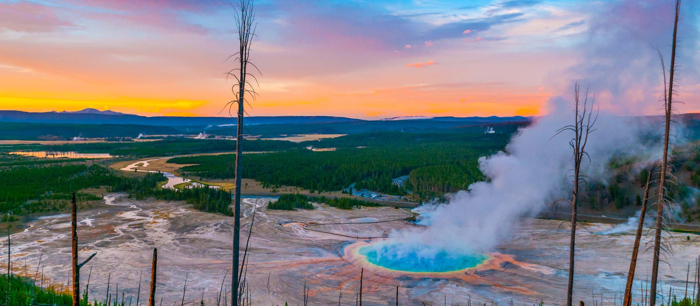
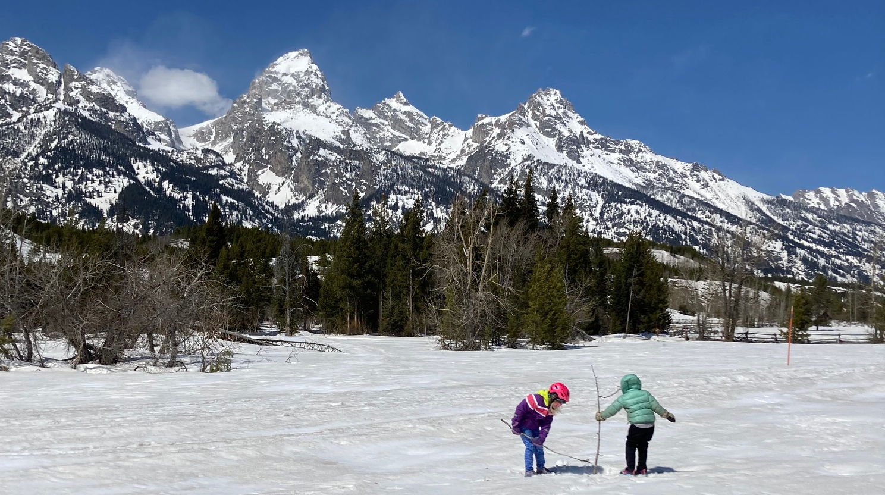
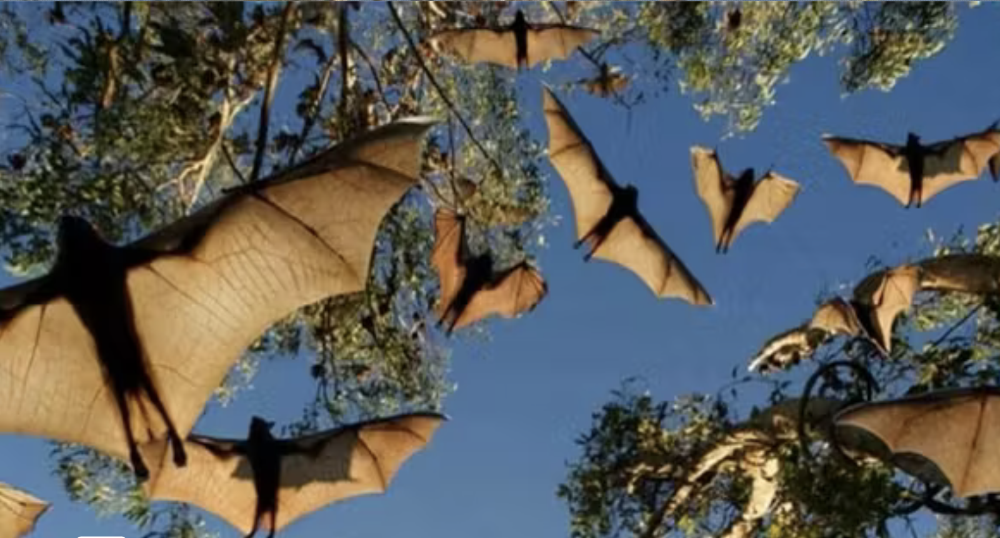
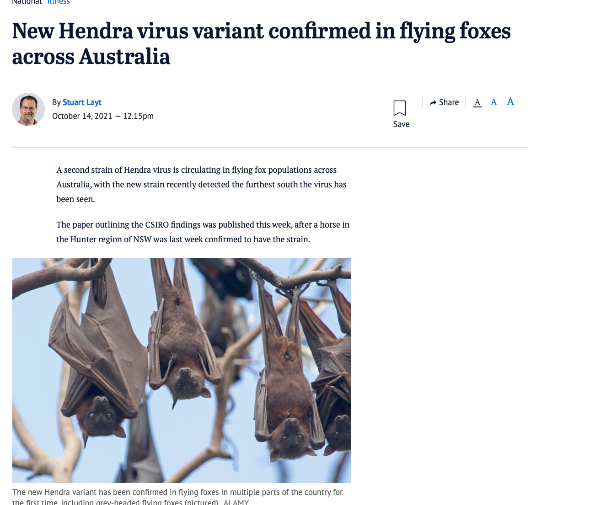
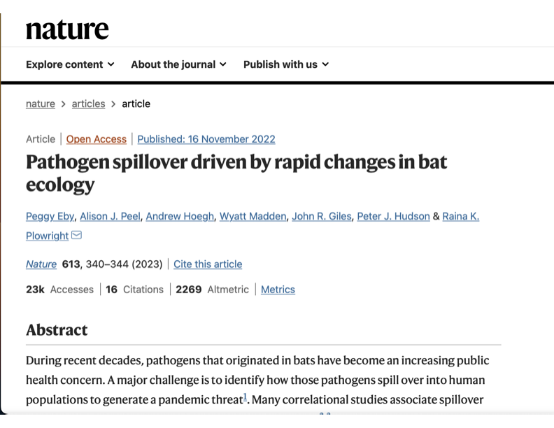
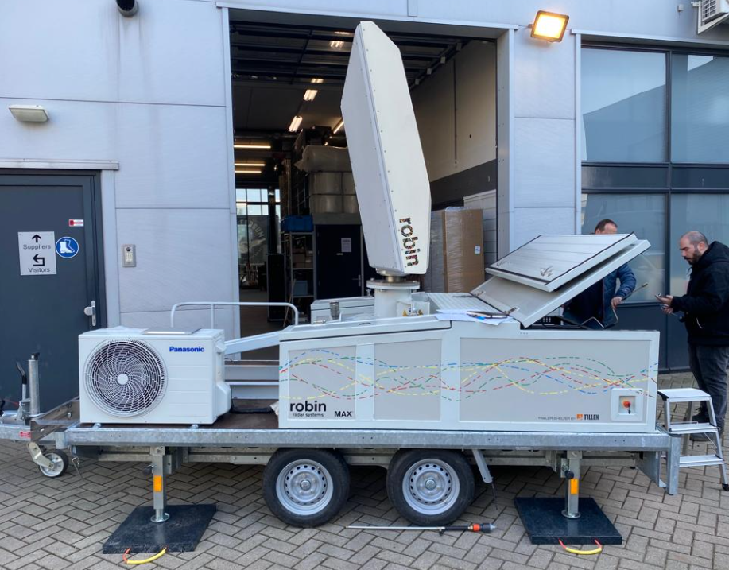
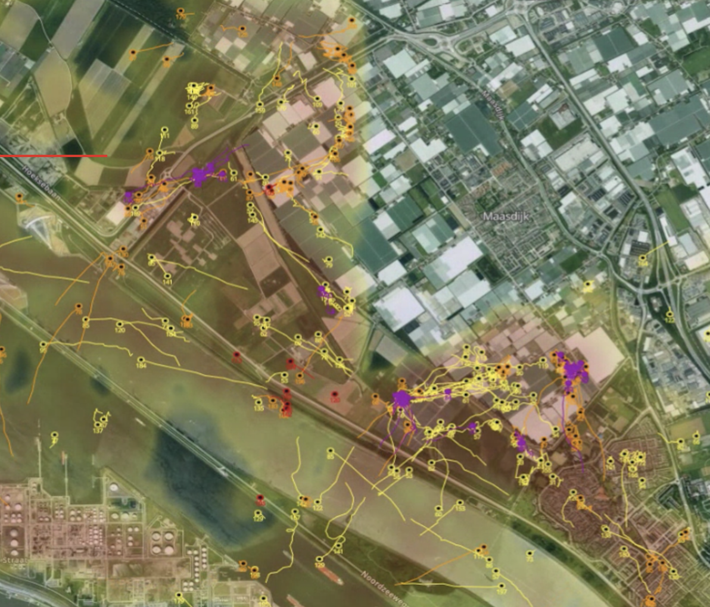
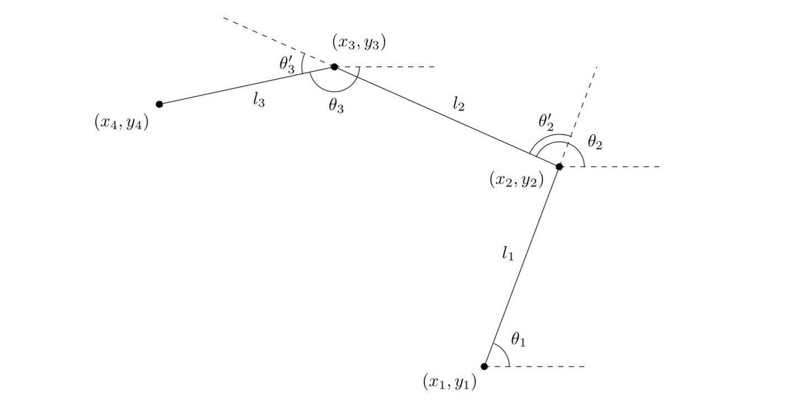

```{r setup, include=FALSE}
knitr::opts_chunk$set(echo = FALSE)
knitr::opts_chunk$set(message = FALSE)
library(knitr)
library(ggplot2)
library(dplyr)
library(mnormt)
library(circular)
```


## Particle filtering methods for animal movement modeling

```{r, out.width = "500px"}

```

# PRESENTATION OVERVIEW

## Presentation Overview

1. A little about me...

2. Collaborative research projects that motivated this work

3. Animal movement model primer

4. Agent-Based Models with SMC

## My Research Philosophy

- “The best thing about being a statistician is that you get to play in everyone’s backyard.” - John Tukey\

- "Problem first, not solution backward" - Jeff Leek\
```{r, out.width = "100px"}
knitr::include_graphics("https://cdn.pixabay.com/photo/2012/04/13/20/57/hammer-33617__480.png")
```

 
- Understand and report uncertainty\

- Create software for implementation


## Griffith University

>- Visiting Research Fellow in the Centre for Planetary Health and Food Security

```{r, out.width = "400px"}
knitr::include_graphics("Griffith.png")
```


## Montana State University

>- Associate Professor of Statistics

```{r, out.width = "1000px"}
knitr::include_graphics("https://msuadmissions.files.wordpress.com/2012/11/prospectivewelcome.gif")
```

## Montana State University

>- Associate Professor of Statistics (_on sabbatical_)

```{r, out.width = "800px"}
knitr::include_graphics("https://bloximages.chicago2.vip.townnews.com/missoulian.com/content/tncms/assets/v3/editorial/1/26/12683bb0-f297-5d98-aad8-f08d34b7a683/57b73db33ce8d.image.jpg?resize=1200%2C783")
```


# MOTIVATING PROJECTS: Grizzly Bears

## Grizzly Bear Range in GYE
```{r, out.width = "800px"}
knitr::include_graphics("https://www.nps.gov/yell/learn/nature/images/griz_sow.jpg?maxwidth=1200&maxheight=1200&autorotate=false")
```


## Greater Yellowstone Ecosystem
```{r, out.width = "800px"}

```

## Greater Yellowstone Ecosystem
```{r, out.width = "800px"}

```

## Grand Teton NP

```{r, out.width = "900px"}

```


## Research Problem: Expanding Grizzly Range
```{r, out.width = "600px"}
knitr::include_graphics("https://d9-wret.s3.us-west-2.amazonaws.com/assets/palladium/production/s3fs-public/media/images/GYE-GB-Occupied-Range-1990-2020.gif")

```

## Research Problem

>- Use historical telemetric data from individual grizzly bears to understand and model population dynamics and predict when/where grizzly bears will be.

>- Grizzly bears establish a home range and can be territorial.

>- Range expansion is typically a product of males (young or old) searching for their own home range after being forced out.

## {data-background-video="animation.mp4"}


# MOTIVATING PROJECTS: Flying Foxes

## Flying Foxes
```{r, out.width = "800px"}

```


## Hendra Virus Spillover
```{r, out.width = "800px"}

```

## Hendra Virus Spillover

```{r, out.width = "800px"}

```

## Flying Fox Behavior

```{r, out.width = "800px"}

```

## {data-background-video="flyout.mov"}

## Research Problem

>- Hendra virus spillover is most likely during periods with low natural food availability.

>- Spillover risk influenced by bat-horse interface and potentially exacerbated by higher viral shedding levels due to poor nutrition.

>- Use radar, across wide spectrum of food availability, to understand bat movement behavior and how it relates to the spillover risk of Hendra virus.

## Radar Data

```{r, out.width = "700px"}

```


# ANIMAL MOVEMENT MODELS


## Positional Data to Movement Modeling

```{r, out.width = "900px"}

```


## Animal Movement Models

>- Step Length: is a distribution for distance traveled in a specific period

>- Angular Direction:\
```{r, out.width = '400px', }
data.vm <- rvonmises(n=1000, mu=circular(0), kappa=3) 

# Plot data set. All points do not fit on plot.
plot(data.vm, stack=TRUE, bins=150, main = 'Histogram of Angular Data') 

```


## Data Model

$$\underline{z}_{t} = H_t \underline{s}_{t} + \underline{\epsilon}_t, \; \; \;\;\;\; \underline{\epsilon}_t \sim N(0,\sigma^2_{\epsilon} I)$$
where $\underline{z}_t$ is a matrix of the observed locations for the agents at time t, $H_t$ is an incidence matrix to determine whether an agent is observed at time t, $\underline{s}_t$ is the latent location at time, and $\epsilon_t$ is the error process

- This model can be formulated as a state-space model (of HMM)

## Process Model

$$\underline{s}_{i,t} = \underline{s}_{i,t-1} + u_{i,t}\underline{\delta}_{i,t} + \underline{\eta}_{i,t}$$

>- $u_{i,t}$ represents the speed
>- $\underline{\delta}_{i,t}$ is a unit vector for the directional component of the velocity

#### Angular Heading
$$\left(\delta_{x,i,t}, \delta_{y,i,t}\right)' = \left( \cos(\theta_{i,t}), \sin(\theta_{i,t}) \right)$$ 
$$\theta_{i,t}  \sim VonMises(\mu, \kappa)$$
>- $\mu$ is an angular heading and $\kappa$ is a concentration parameter

#### Speed
$$u_{i,t} = N_+(\mu_u, \sigma^2_u)$$


## Additional Complexity

- Mixture distribution on the angle heading

- Spatial covariates (can influence step distance and heading)

- State switching models (different movement during different behaviors)

- Collective movement (animals influence other behavioral patterns)


# AGENT BASED MODELS

## Agent Based Models

- Agent based models are a simulation based approach using a set of _agents_.

- Each agent is given a relatively simple set of rules, which control interactions between agents.

- The collective behavior of agents can model complex population level characteristics.

## Agent Properties
The agents have a set of characteristics:

>- movement speed
>- angular heading
>- environmental characteristics
>- home range affinity
>- collective movement

## Collective Movement

Collective animal movement refers to a situation where animals influence each others behavior.

Commonly, there are three types of behaviors considered

- Attraction
- Alignment
- Repulsion


## Overview of Applications
- Guppies (McDermott and Wikle, 2017)
- Rabies (Hooten and Wikle, 2012)
- Locusts (Bernoff, 2020 )
- Infectious Disease (Higdon, et. al, 2018)


## Self Propelled Particles

_The only rule of the model is: at each time step a given particle driven with a constant absolute velocity assumes the average direction of motion of the particles in its neighborhood of radius r with some random perturbation added._ 

Vicsek, et. al 1995.


# COMPUTATION

## Agent-Based Models as State Space Model
- We want to estimate model parameters, denoted as $\Theta$, such as those in the probability distributions for step size and turning angle.

- However for each agent at a given time we also need to estimate a set of "state parameters", denoted ${X}$:

    - step size for time t
    - turning angle for time t
    - agent location (x and y) coordinates

## Approximate Bayesian Computation
- Approximate Bayesian Computation (ABC) can be used for model estimation.

- Where MCMC algorithms propose and accept parameter values based on evaluating the likelihood, ABC methods summarize the data and accept moves based on similarity in the observed data and, in this case, agent movements.

## ABC Algorithm
For iter in 1:N
    
1. sample $\theta^{'} \sim p(\theta)$
2. __simulate__ $\tilde{y} \sim p(y|\theta^{'})$
3. accept $\theta^{'}$ if $d(m(y),m(\tilde{y})) < \epsilon$, where $m()$ is summary statistic and $d()$ is a distance function


## Summary Statistic
- Ideally, $m()$ is a sufficient statistics. If this is the case and $\epsilon \rightarrow 0$, then ABC takes samples from posterior.
- Otherwise ...
- Choose a reasonable set of statistical measures
- In this case, the agent parameters are not the primary interest, rather they are a means to understanding population level characteristics.


## MCMC Algorithm (Metropolis-Hastings)
We want the joint posterior distribution $p(\Theta,{X}|y)$.

- Propose: $\{\Theta, {X}\}^{'} \sim g(\{\Theta, {X}\}^{'}|\{\Theta, {X}\})$ 
- Compute: $\alpha = \frac{p(y|\{\Theta, {X}\}^{'})p(\{\Theta, {X}\}^{'})g(\{\Theta, {X}\}|\{\Theta, {X}\}^{'})}{p(y|\{\Theta, {X}\})p(\{\Theta, {X}\})g(\{\Theta, {X}\}^{'}|\{\Theta, {X}\})}$
- Accept: $\{\Theta, {X}\}^{'}$ with prob $= min(1, \alpha)$

## Particle-MCMC

- Particle-MCMC combines particle-based methods with MCMC.

- A particle filter is used to propose $p({X}|\Theta)$ in the MCMC framework

- There are ways to carry out a Gibbs-sampler and iterate between sampling ${X}$ and $\Theta$. (previous talks on P-MCMC and PMMH)

## Agent-Based Models as a simulation-based approach

- ABMs are extremely flexible models, where complex population dynamics can be encoded with simple individual level rules.

- Parameters are evaluated and estimated by simulating locations for agents and comparing simulated outcomes with true observed outcomes.

- SMC techniques are a natural way to simulate underlying state parameters and proposed agent locations that can be embedded in MCMC frameworks.


## Statistical Model Fitting
- Complex, collective movement models where agents interact pose challenges for parameter estimation.

- Without collective movement, movement for individuals can be conducted in parallel.

- Parameters associated with the agent rules are estimated to allow for uncertainty in model parameters.


# THE END


## andrew.hoegh@montana.edu or a.hoegh@griffith.edu.au

```{r, out.width = "500px"}

```
